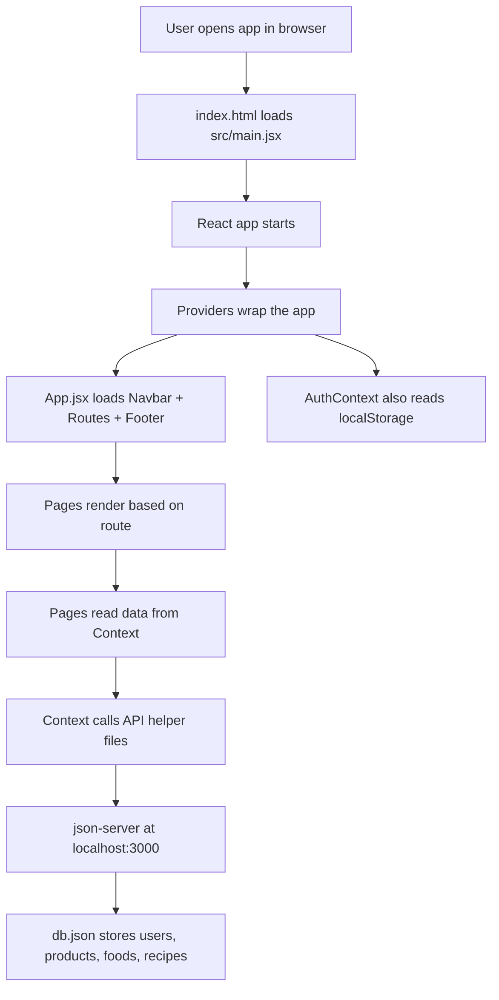

# ALL IN ONE
## Full Project Explanation in Very Simple English

This file is written in a way that a person can read it and almost **see the UI in the mind** without opening the project.

I studied the current code and the `Project Guideline.pdf`.

I did **not** change your app code.
This file is only for explanation and presentation.

---

## 1. What this project is in one simple line

`All In One` is a React web app where one user can do many daily things in one place:

- shop products
- order food
- watch recipe details
- manage cart
- login and signup
- try a simple investment dashboard

So the basic idea is:

> One website, many useful services, one common user experience.

---

## 2. First imagine the app without opening it

Before we talk about code, first imagine how the app looks.

### 2.1 What you see first

When the app opens, the user sees:

- a white top navbar
- a clean home page
- large visual blocks
- cards for shopping, food, and investment
- small live-looking dashboards
- a footer at the bottom

The app does not feel like a small single-page demo.
It feels like a **mini platform** where many services are kept inside one product.

### 2.2 Top area of the app

At the very top there is a **white sticky navbar**.

That means:

- it stays visible on top while the user scrolls
- the app name `All In One` is on the left
- main links are in the center
- login/signup or cart/logout are on the right

If the user is not logged in:

- `Login`
- `Sign Up`

If the user is logged in:

- cart icon with a red badge count
- logout button

This already gives a product-like feeling because the navbar is always present and always useful.

### 2.3 Home page look

The home page feels like a **business landing page plus dashboard**.

At the top of the home page:

- there is a big carousel
- each slide has text on one side and a big image on the other side
- the text talks about managing life, shopping, food, and health

Below that:

- there is a moving offer strip
- it keeps sliding text like deals, cashback, free delivery, and stock growth

Below that:

- there are 3 big feature cards
- one card is for shopping
- one card is for food
- one card is for investment

Each card has:

- a large image
- an overlay section
- one clear action button like `Shop Now`, `Order Now`, or `Start Investing`

After that, the home page continues with a second dashboard-like section:

- a shopping preview block
- a food preview block
- one recipe video block
- one mini investment block

So the home page is not only a welcome page.
It is also a **navigation hub** for the whole app.

### 2.4 Shopping page look

When the user goes to shopping:

- a sticky filter bar appears below the navbar
- category buttons are shown
- a search bar is shown
- then a dark hero section says the user can discover products
- below that, products are grouped by category

Each category section has:

- category heading
- `View All` button
- product cards in a row

Each product card has:

- image
- title
- price
- `Add to Cart` button

This page feels like a light e-commerce homepage.

### 2.5 Food page look

The food page layout is very similar to shopping.
This keeps the app consistent.

It has:

- sticky filter bar
- search
- dark hero banner
- category sections

But the content is different:

- veg items
- nonveg items
- recipe items

For normal food, the user sees price and `Add to Cart`.
For recipe items, the user sees `Show Recipe`.

So the food page mixes **ordering** and **learning** in the same area.

### 2.6 Category page look

When the user clicks a category like `veg`, `nonveg`, or a shopping category:

- the page becomes more focused
- only one category is shown
- the page title changes according to the route
- a grid of cards appears
- pagination buttons show up if items are more

This feels like a detail listing page.

### 2.7 Details page look

This is one of the richest screens in the app.

The details page looks like this:

- back button on top
- left side: image card of the selected item
- right side: big recipe video section
- below video: small stat cards for cook time, steps, ingredients
- below that: recipe steps in separate blocks
- each step shows ingredients as small rounded buttons
- then an `All Ingredients` section
- then a `Related Dishes` section

So this page is not only showing one food item.
It creates a full recipe experience.

### 2.8 Cart page look

The cart page is simple and practical.

The user sees:

- list of cart items
- product image
- title
- price
- minus button
- quantity number
- plus button
- remove button
- total amount at the bottom

It is easy to understand and easy to demo.

### 2.9 Login and signup page look

These pages use a split-screen layout on desktop.

Left side:

- dark blue background
- product logo
- white text
- icons for invest, shop, eat, learn

Right side:

- form inputs
- login or register button

This gives a branded product feel instead of a plain form page.

### 2.10 Investment page look

The investment page feels different from shopping and food.
It looks more like a small finance dashboard.

The user sees:

- top statistic cards
- large chart for share price performance
- trading panel on right side
- live price effect
- buy and sell buttons
- portfolio section
- profit/loss details
- future vision content cards

This page is more data-heavy and dashboard-like.

---

## 3. Main purpose of this project

The main purpose of this project is to show that one frontend app can combine:

- product browsing
- food ordering
- recipe exploration
- cart handling
- login persistence
- investment dashboard style interaction

So this project is strong because it is **multi-module**.
It is not doing only one thing.

---

## 4. Core project idea in product language

If you want to say it in presentation, use this:

> All In One is a multi-service web platform that brings shopping, food, recipes, cart management, login, and investment demo features into one single React application.

If you want even easier English:

> This is one website where a user can shop, order food, check recipes, manage cart, and use a simple investment page without leaving the app.

---

## 5. The biggest strength of this project

The biggest strength is not only the number of pages.

The biggest strength is this:

> The UI, the routes, the context state, and the local backend are all connected in a clear flow.

That means when the user clicks something on the screen, there is a clear chain:

`UI action -> React state or route change -> API helper -> local backend -> updated UI`

This is what makes the project feel real.

---

## 6. Tech stack with very clear reason

| Layer | Tech used | Why it is used here |
| --- | --- | --- |
| Frontend framework | React 19 | To build the app in reusable components |
| Build tool | Vite | Fast dev server and fast project setup |
| Styling | Bootstrap + custom CSS + inline styles | Fast layout plus custom visual control |
| Routing | React Router DOM | To move between pages without full page reload |
| Global state | Context API + `useReducer` | To share auth, products, food, cart, and portfolio state |
| Notifications | React Toastify | To show quick messages like login success or add to cart |
| Charts | Recharts | To create charts in home and investment pages |
| Icons | React Icons + Lucide React | To make UI easy to scan |
| Mock backend | json-server + json-server-auth | To simulate real API and auth flow locally |
| Persistent browser storage | `localStorage` | To keep user login after refresh |
| Data file | `db.json` | To act as local database |

### Why this stack is good for this project

This stack is a good fit because:

- React handles many sections well
- Vite keeps development fast
- Context API is enough for this project size
- Bootstrap speeds up UI building
- json-server gives quick backend-style data
- Toastify and Recharts improve user experience

So the stack is practical, not random.

---

## 7. High level system design

Here is the full system idea in one diagram:



### Very simple explanation of this diagram

The browser starts the app.
Then React starts.
Then global providers are added.
Then the app loads the correct page.
Then the page reads data from shared state.
If needed, shared state gets data from the backend.
The backend reads from `db.json`.

So everything is connected in one simple chain.

---

## 8. Project structure in simple words

### 8.1 Main folders

| Folder | Simple meaning |
| --- | --- |
| `src/components` | Reusable UI pieces like navbar, footer, cards, filter bar |
| `src/context` | Global shared state |
| `src/features` | Big business features like shopping, food, investment, auth |
| `src/pages` | Route-level page screens |
| `src/utils/api` | API helper logic |
| `src/utils/constant` | Common constants like base URL |
| `src/assets` | Local images |
| project root `db.json` | Local database |

### 8.2 Most important files

| File | Why it matters |
| --- | --- |
| `src/main.jsx` | Real entry point of the app |
| `src/App.jsx` | Main layout and route map |
| `src/context/authContext/AuthContext.jsx` | Login state, storage, auth restore |
| `src/context/product_context/ProductsContext.jsx` | Product fetch and product filter state |
| `src/context/foodContext/FoodContext.jsx` | Food fetch and food-recipe merge |
| `src/context/cartContext/CartContext.jsx` | Cart state for whole app |
| `src/context/portfolio_context/PortfolioContext.jsx` | Portfolio state for investment module |
| `src/pages/HomePage.jsx` | Main landing screen |
| `src/features/shoping_feature/components/ShopingLanding.jsx` | Shopping module screen |
| `src/features/food_feature/component/FoodLanding.jsx` | Food module screen |
| `src/pages/CategoryPage.jsx` | Dynamic category screen |
| `src/pages/DetailsPage.jsx` | Food detail and recipe screen |
| `src/pages/CartsPage.jsx` | Cart screen |
| `src/features/invest_on_us_feature/components/InvestOnUS.jsx` | Investment screen |
| `src/utils/api/cartApis/cartApis.js` | Cart backend logic |
| `src/features/food_feature/food-model/foodModel.js` | Most important food data model logic |

---

## 9. Startup flow from the first second

This section explains what happens from the moment the app opens.

### 9.1 Step by step startup

1. `index.html` loads in browser.
2. It loads `src/main.jsx`.
3. `main.jsx` imports Bootstrap CSS and Bootstrap JavaScript.
4. `main.jsx` creates the React root.
5. Then it wraps the app with providers:
   - `ThemeProvider`
   - `BrowserRouter`
   - `AuthProvider`
   - `CartProvider`
   - `ProductsProvider`
   - `FoodProvider`
   - `PortfolioProvider`
6. Then `App.jsx` renders.

### 9.2 Why providers are wrapped at the top

Because many pages need the same data:

- navbar needs auth and cart
- shopping pages need product state
- food pages need food state
- investment page needs portfolio state

If providers were lower in the tree, many pages would not be able to read the shared data.

So this provider structure is important system design.

---

## 10. Route design

The app routes are:

| Route | Meaning |
| --- | --- |
| `/` | Home |
| `/invest` | Investment module |
| `/shopping` | Shopping landing |
| `/orderFood` | Food landing |
| `/login` | Login page |
| `/signup` | Signup page |
| `/cart` | Cart page |
| `/category/:name` | Shopping category page |
| `/food/:name` | Food category page |
| `/details/:type/:id` | Details page |

### Why the route design is good

It uses both:

- static routes
- dynamic routes

Dynamic routes are important because:

- one page component can show many categories
- one detail page can show many items
- the URL itself carries useful meaning

Example:

- `/category/shoes`
- `/food/veg`
- `/details/food/15`

This is a good thing to explain in presentation.

---

## 11. Database design in very simple words

The local backend data is inside `db.json`.

Main collections:

- `users`
- `products`
- `foods`
- `recipes`
- `categories`

### 11.1 What is inside `users`

Each user stores:

- email
- password
- name
- id
- cart
- portfolio

This is why cart and investment data can be connected to login.

### 11.2 What is inside `products`

Products contain fields like:

- id
- title
- category
- brand
- price
- image
- searchKey

This supports shopping, filtering, card rendering, and search.

### 11.3 What is inside `foods`

Foods contain:

- id
- name
- recipeId
- category
- image
- price

### 11.4 What is inside `recipes`

Recipes contain:

- id
- steps
- cook time
- video URL

### Why food and recipe are separate in backend

Because one record is about the food item itself, and the other is about how to make it.

This separation is good.
But the UI needs them together.
That is why the frontend builds a new merged model.

This is one of the smartest parts of the project.

---

## 12. The most important data modeling idea

### 12.1 Food and recipe merge

The file:

`src/features/food_feature/food-model/foodModel.js`

does a very important job.

### What problem it solves

The backend gives:

- foods list
- recipes list

But the UI wants:

- one clean list for display
- food items
- recipe items
- detail page support
- category support

### What the code does

It builds:

- normal food objects with `type: "food"`
- recipe objects with `type: "recipe"`
- a merged final list

So after this transformation, the frontend gets one clear shape to render.

### Why this is important

Because after this:

- food page can show both foods and recipes
- recipe button logic becomes simple
- category `recipe` can work
- detail page can reuse the same route pattern

This is a very good technical point for presentation.

If the teacher asks:

> Which part of your code shows thinking and not only UI building?

You can say:

> The food model file, because it transforms raw backend data into UI-ready data.

---

## 13. Full user flow from start to end

Now let us walk through the app like a real user.

### 13.1 First visit flow

The user opens the app.

What happens:

- top navbar is visible
- home page is loaded
- products and food data start loading in background from context providers
- if a user was already logged in before, auth is restored from `localStorage`

So even before the user clicks anything, the app is preparing global data.

### 13.2 Home page exploration flow

The user sees the home screen.

The user can:

- slide the hero carousel
- read the moving offer strip
- click on shopping card
- click on food card
- click on investment card
- preview products
- preview foods
- preview random recipe
- preview investment section

This means the home page is acting like a smart dashboard and not just a banner page.

### 13.3 Shopping flow

Suppose the user clicks `Shop Now`.

Flow:

1. App scrolls to top.
2. Product category state is reset to `all`.
3. User is sent to `/shopping`.
4. Shopping page shows sticky filter bar.
5. Product sections appear by category.
6. User types in search.
7. Debounce waits a little.
8. Context filters the products.
9. Matching cards are shown.
10. User clicks `View All`.
11. App opens dynamic category page.
12. User clicks `Add to Cart`.
13. Backend user cart is updated.
14. Cart badge in navbar updates.

This is a complete UI to state to backend to UI loop.

### 13.4 Food flow

Suppose the user clicks `Order Now`.

Flow:

1. App goes to `/orderFood`.
2. Food landing page loads.
3. User sees grouped food and recipe sections.
4. Search can reduce the visible data.
5. Normal food card gives `Add to Cart`.
6. Recipe card gives `Show Recipe`.
7. Clicking a recipe sends user to details page.
8. Details page shows image, video, steps, ingredients, and related dishes.
9. User can add ingredients to cart one by one.

This is a nice mixed experience because the user can either:

- order food
- or explore recipe details

### 13.5 Login and cart flow

Suppose the user is not logged in and clicks `Add to Cart`.

Flow:

1. UI checks if user exists.
2. If user is missing, a toast says login first.
3. User goes to login page.
4. User submits login form.
5. Backend login endpoint is called.
6. AuthContext stores user in state.
7. AuthContext also stores user in `localStorage`.
8. CartContext reacts to login and loads user cart.
9. Navbar changes from login/signup to cart/logout.

This is why the app feels connected.

### 13.6 Investment flow

Suppose the user opens the investment page.

Flow:

1. Page loads a finance-style dashboard.
2. PortfolioContext reads current portfolio from backend.
3. The share price starts moving with timer-based demo data.
4. User enters quantity.
5. Buy updates reducer state.
6. Sell updates reducer state.
7. Total shares, average price, invested amount, and profit/loss recalculate.
8. Updated totals are saved back to backend.

So even though share price is simulated, the user action flow is still real.

---

## 14. State management design explained like a senior developer

This project uses **Context API + reducer pattern**.

This choice makes sense because the app has many modules that need shared data.

### 14.1 AuthContext

Purpose:

- store logged in user
- restore user from browser storage
- remove user on logout
- sync auth across tabs using `storage` event

So AuthContext is not only holding state.
It is also handling browser persistence.

### 14.2 ProductsContext

Purpose:

- fetch all products
- keep original cache
- keep filtered display products
- keep selected category
- keep loading and error state

Very important point:

It keeps both:

- `cache`
- `displayProduct`

Why both are useful:

- `cache` keeps full raw data
- `displayProduct` keeps current filtered data

This is good design because filtering does not destroy the original data.

### 14.3 FoodContext

Purpose:

- fetch foods
- fetch recipes
- merge both
- store final food cache
- store filtered display list
- store selected category

This context is stronger than simple fetch logic.
It acts like a small data preparation layer.

### 14.4 CartContext

Purpose:

- hold cart for the full app
- load user cart after login
- let navbar and cart page read the same cart state

This is why the cart badge and cart page feel synced.

### 14.5 PortfolioContext

Purpose:

- keep portfolio lots in arrays
- load saved portfolio from backend
- support buy and sell logic

This context is useful because investment state must be reused by the full investment screen.

### 14.6 Why reducer is used in many contexts

Reducer is useful when state changes are not simple.

Examples:

- login and logout
- fetch start, success, error
- filter product
- buy stock
- sell stock

Reducer gives named actions, which makes logic easier to explain and maintain.

---

## 15. API layer design

The project has a clean API helper folder.

This is a good thing.
It means UI files are not directly writing raw fetch code everywhere.

### Main API helper files

| File | Role |
| --- | --- |
| `authapis.js` | login and register |
| `shopProductApi.js` | fetch shopping products |
| `foodApi.js` | fetch foods and recipes |
| `cartApis.js` | get cart, add, remove, update quantity |
| `portfolioapis.js` | get and save portfolio |

### Why this is good architecture

Because now the project has a clean separation:

- UI components render
- contexts manage shared state
- API files talk to backend

This is much better than mixing everything in one file.

---

## 16. The biggest and most important section
## UI behaviour and the exact code responsible for it

This section is the heart of the explanation.

The goal here is:

> If someone asks "this screen is doing this, but why?", we should be able to point to the exact code flow.

I will explain each major behaviour in this format:

- what the user sees
- which files handle it
- how the code makes it happen

---

## 16.1 Why the navbar is always visible

### What the user sees

On every page, the navbar stays on top.
The footer also stays at the bottom.
Only the middle page content changes.

### Main files

- `src/App.jsx`
- `src/main.jsx`

### How the code makes it happen

`App.jsx` renders:

- `Navbar`
- `ToastContainer`
- `Routes`
- `Footer`

Because `Navbar` and `Footer` are outside the route-specific page content, they do not disappear when the route changes.

This is why:

- home page has navbar
- shopping page has navbar
- food page has navbar
- investment page has navbar

The app always feels like one connected product.

---

## 16.2 Why the navbar changes after login

### What the user sees

Before login:

- login link
- signup button

After login:

- cart icon with badge
- logout button

### Main files

- `src/components/layout/Navbar.jsx`
- `src/context/authContext/AuthContext.jsx`
- `src/context/cartContext/CartContext.jsx`

### How the code makes it happen

`Navbar.jsx` reads `user` from auth context.

Then it uses conditional rendering:

- if no user, show login and signup
- if user exists, show cart and logout

Also `Navbar.jsx` reads `cart` from cart context and calculates badge quantity using `reduce`.

So one file is visually rendering the state, but two contexts are feeding the data:

- auth context for login state
- cart context for cart count

This is a perfect example of shared state controlling UI.

---

## 16.3 Why login stays after refresh

### What the user sees

After logging in, the user refreshes the page and is still logged in.

### Main file

- `src/context/authContext/AuthContext.jsx`

### How the code makes it happen

AuthContext does 3 important things:

1. On first load, it reads `localStorage`.
2. When user changes, it writes the user into `localStorage`.
3. On logout, it removes `localStorage` user.

So login is not only stored in memory.
It is also stored in browser storage.

That is why refresh does not lose the session.

---

## 16.4 Why login can react to other browser tabs

### What the user sees

If auth data changes in another tab, the current tab can react.

### Main file

- `src/context/authContext/AuthContext.jsx`

### How the code makes it happen

AuthContext adds a browser `storage` event listener.

That means if the `user` key changes in browser storage:

- logout can be detected
- login can be detected

This is a more advanced browser event feature.

Very important truth:

- the project does **not** use Broadcast Channel API
- it uses the browser `storage` event for auth sync

So if the teacher asks about events, you can honestly say:

> We used the browser storage event for auth synchronization across tabs.

---

## 16.5 Why navbar links show active style

### What the user sees

When the user is on a route:

- that nav link becomes active
- underline becomes visible
- text becomes stronger

### Main file

- `src/components/layout/Navbar.jsx`

### How the code makes it happen

`Navbar.jsx` uses `NavLink` from React Router instead of simple `Link`.

`NavLink` knows the current route.

Inside the same file there is custom CSS that changes:

- color
- font weight
- underline width

for active links and hover state.

So active navigation is happening because React Router route state and custom CSS are working together.

---

## 16.6 Why the hero section slides like a carousel

### What the user sees

The top home section changes slides with left and right arrows.

### Main files

- `src/components/ui/Hero.jsx`
- `src/main.jsx`

### How the code makes it happen

The Hero component uses Bootstrap carousel HTML structure.

Important points:

- it has `carousel slide`
- it has carousel items
- it has control buttons
- Bootstrap JavaScript is imported in `main.jsx`

Without Bootstrap bundle JavaScript, the carousel behaviour would not work.

So the moving slide behaviour is not custom JavaScript written by the project.
It is Bootstrap behaviour connected to Bootstrap markup.

---

## 16.7 Why the offer strip keeps moving

### What the user sees

There is a moving line of text under the hero section with offers and updates.

### Main file

- `src/components/ui/Hero.jsx`

### How the code makes it happen

This behaviour is created with CSS animation.

The file defines:

- a wrapper
- a moving inner strip
- `@keyframes scroll`

The inner strip moves from right to left forever.

Also, when the mouse hovers on it, the animation pauses.

So this is a pure visual behaviour created by CSS, not API or state.

---

## 16.8 Why home page cards feel like entry doors to modules

### What the user sees

The home page has big cards:

- shopping
- food
- investment

Each card feels like it opens a major part of the app.

### Main file

- `src/pages/HomePage.jsx`

### How the code makes it happen

These cards use button click handlers.

Each handler usually does 3 things:

1. scroll to top
2. reset some category state if needed
3. navigate to another route

Examples:

- shopping card sends user to `/shopping`
- food card sends user to `/orderFood`
- invest card sends user to `/invest`

So these are not passive design cards.
They are active route control elements.

---

## 16.9 Why the shopping preview on home page looks mixed and fresh

### What the user sees

On home page, product preview looks grouped by category and visually varied.

### Main file

- `src/pages/HomePage.jsx`

### How the code makes it happen

Home page reads product cache from context.

Then it:

- groups products by category
- shuffles them
- keeps a small number from each category
- renders each category in a carousel slide

So the UI looks like a curated preview, not a raw database dump.

That is a good design choice because the home page should tease the module, not fully replace it.

---

## 16.10 Why the food preview on home page feels curated

### What the user sees

The food preview section on home page shows:

- veg items
- nonveg items

and not all food records.

### Main file

- `src/pages/HomePage.jsx`

### How the code makes it happen

The home page:

- filters only `veg` and `nonveg`
- groups them by category
- shuffles them
- keeps only a few items

This creates a clean preview.

If it showed all food items directly, the home page would feel crowded.

---

## 16.11 Why one random recipe video appears on the home page

### What the user sees

There is one special recipe block with a video.

### Main file

- `src/pages/HomePage.jsx`

### How the code makes it happen

The code:

- filters food items that have a recipe video
- picks one random item
- converts the YouTube URL into embed form
- renders the iframe

That is why the section feels special and different from other cards.

This is a nice UX idea because it breaks repetition and creates curiosity.

---

## 16.12 Why the home investment block feels live

### What the user sees

On home page, the investment preview block shows a chart and gain value that changes over time.

### Main file

- `src/pages/HomePage.jsx`

### How the code makes it happen

The file uses:

- `useState`
- `useEffect`
- `setInterval`

Every few seconds:

- chart data is updated
- gain value changes

So the UI appears live.

Important honesty:

- this is demo-generated frontend data
- it is not a real market API

This is okay for presentation if you say it clearly.

---

## 16.13 Why the shopping page search feels smooth

### What the user sees

When the user types in shopping search:

- results do not jump too fast on every single key press
- it feels smoother

### Main files

- `src/features/shoping_feature/components/ShopingLanding.jsx`
- `src/context/product_context/ProductsContext.jsx`

### How the code makes it happen

Shopping page uses a debounce pattern.

That means:

- user types
- app waits 500ms
- then filter action runs

After that, the reducer filters products from cached data.

This gives 2 benefits:

- better user experience
- less unnecessary repeated work

This is a good example of UI behaviour improved by simple timing logic.

---

## 16.14 Why the shopping page shows categories with only a few products first

### What the user sees

The shopping landing page does not show all products together.

Instead it shows:

- one section per category
- only a few products in each
- `View All` button for the full category

### Main files

- `src/features/shoping_feature/components/ShopingLanding.jsx`
- `src/features/shoping_feature/shopingDataModel/buildShopingmodel.js`

### How the code makes it happen

The helper function groups products by category and stores only a limited number for preview.

This is important because:

- first screen stays clean
- user can scan categories fast
- full list is still available later

So the landing page is acting as a category preview page, not a full catalog page.

---

## 16.15 Why category buttons work like smart navigation

### What the user sees

In shopping and food pages, the category buttons:

- change selected category
- change the route
- update the visible items
- show active button style

### Main file

- `src/components/ui/FilterBar.jsx`

### How the code makes it happen

The filter bar does these things on button click:

1. dispatches `SET_CATEGORY`
2. checks whether category is `all` or specific
3. navigates to the correct route
4. scrolls to top

That means the category button is doing both:

- state change
- route change

This is very good UX because the URL and UI stay in sync.

---

## 16.16 Why the filter bar stays below the navbar while scrolling

### What the user sees

On shopping and food pages, the filter bar sticks below the navbar.

### Main file

- `src/components/ui/FilterBar.jsx`

### How the code makes it happen

The wrapper uses:

- `position-sticky`
- `top: "55px"`

Why `55px` matters:

- the navbar height is 55px
- so the filter bar stays exactly below it

This is a small detail, but it makes the app feel more polished.

---

## 16.17 Why category page changes based on the URL itself

### What the user sees

If the URL changes from:

- `/category/electronics`
to
- `/category/shoes`

then the page content changes too.

### Main file

- `src/pages/CategoryPage.jsx`

### How the code makes it happen

The page uses `useParams()` to read the route value `name`.

Then a `useEffect` runs when `name` changes.

That effect:

- dispatches `SET_CATEGORY`
- resets page number
- scrolls to top

Then the component filters items using:

- route category
- search text

This is why one page component can handle many categories.

---

## 16.18 Why pagination appears only when needed

### What the user sees

If items are few, no pagination is shown.
If items are many, `Prev` and `Next` appear.

### Main file

- `src/pages/CategoryPage.jsx`

### How the code makes it happen

The page calculates:

- total filtered items
- total pages
- current slice of data

Then it conditionally renders pagination only when:

- filtered data count is greater than items per page

So pagination is smart and conditional.

---

## 16.19 Why clicking card and clicking button do different things

### What the user sees

On some cards:

- clicking the card opens details
- clicking the button only adds to cart

### Main files

- `src/features/food_feature/component/FoodLanding.jsx`
- `src/pages/CategoryPage.jsx`

### How the code makes it happen

The inner button click uses `e.stopPropagation()`.

Why this matters:

- the card itself may also have an `onClick`
- without `stopPropagation()`, button click would also trigger the card click

That would cause a bad bug:

- item gets added
- and detail page opens by mistake

Because of `stopPropagation()`, only the correct action runs.

This is a very important code detail.

---

## 16.20 Why food cards and recipe cards behave differently

### What the user sees

Normal food item:

- shows price
- shows `Add to Cart`

Recipe item:

- shows `Show Recipe`

### Main files

- `src/features/food_feature/food-model/foodModel.js`
- `src/features/food_feature/component/FoodLanding.jsx`
- `src/pages/CategoryPage.jsx`

### How the code makes it happen

The model layer assigns:

- `type: "food"` for normal food
- `type: "recipe"` for recipe entries

Then UI checks `item.type`.

If type is `recipe`:

- open detail page
- show recipe button

If type is normal food:

- show price
- allow add to cart

This is a strong example of good data modeling controlling UI behaviour.

---

## 16.21 Why the details page looks rich even though it uses one route

### What the user sees

Details page feels like a full recipe article page:

- large image
- add to cart button
- veg badge if needed
- recipe video
- cook time
- number of steps
- number of ingredients
- full step list
- ingredient pills
- related dishes

### Main file

- `src/pages/DetailsPage.jsx`

### How the code makes it happen

The page does many small things:

1. Reads route params `type` and `id`.
2. Chooses data source from products or food context.
3. Finds the selected item.
4. Creates `recipeData = item.recipe || item`.
5. Converts video URL to embed URL.
6. Builds `allIngredients` by flattening step ingredients.
7. Renders sections using this prepared data.

The very smart part is:

`item.recipe || item`

This lets the page support both:

- normal food items that contain nested recipe data
- direct recipe items that already are recipe-like objects

That is why one page can handle multiple data shapes.

---

## 16.22 Why ingredient buttons change style after click

### What the user sees

When the user clicks an ingredient button:

- the ingredient appears added
- button style changes for a moment

### Main file

- `src/pages/DetailsPage.jsx`

### How the code makes it happen

The page keeps local state:

- `addedIngredients`

When the user clicks an ingredient:

1. ingredient name is pushed into state
2. cart API is called
3. cart state updates
4. toast is shown
5. after 1.5 seconds, the ingredient name is removed from local state

That is why the button temporarily changes style.

This is a nice micro-feedback pattern.

---

## 16.23 Why related dishes appear at the bottom

### What the user sees

At the bottom of details page, the user sees other items from the same category.

### Main file

- `src/pages/DetailsPage.jsx`

### How the code makes it happen

The code filters the same data source using:

- same category
- different id

Then it slices the first 4 items.

So related dishes are not random.
They are category-based.

This makes the suggestion feel more meaningful.

---

## 16.24 Why cart badge updates after add to cart

### What the user sees

After adding an item:

- cart badge changes
- cart page reflects new item

### Main files

- `src/utils/api/cartApis/cartApis.js`
- `src/context/cartContext/CartContext.jsx`
- `src/components/layout/Navbar.jsx`

### How the code makes it happen

This is the exact chain:

`Add to Cart button click`
-> `addToCartApi(userId, item)`
-> read current user cart from backend
-> update or increase item qty
-> `PATCH` updated cart back to backend
-> return updated cart
-> `cartDispatch({ type: "SET_CART" })`
-> navbar re-renders and badge updates

This is one of the best full-flow examples in the project.

---

## 16.25 Why cart page quantity buttons work correctly

### What the user sees

On cart page:

- `+` increases quantity
- `-` decreases quantity but not below 1
- `Remove` deletes item
- total amount updates

### Main files

- `src/pages/CartsPage.jsx`
- `src/utils/api/cartApis/cartApis.js`

### How the code makes it happen

The cart page is a thin UI layer.
Real data change happens in API helpers.

For increase:

- page calls `updateQtyApi(..., "inc")`

For decrease:

- page calls `updateQtyApi(..., "dec")`

Inside `updateQtyApi`:

- it fetches current cart
- maps over items
- changes matching item qty
- uses `Math.max(1, item.qty - 1)` for safe minimum
- saves cart back

That is why quantity never becomes zero from minus button.

For total amount:

- UI uses `reduce` on cart items

So the total is always computed fresh from current state.

---

## 16.26 Why login form and signup form feel connected

### What the user sees

Both login and signup pages look similar and feel like one family of screens.

### Main files

- `src/features/signup_and_login_feature/components/Login_Register_Form.jsx`
- `src/features/signup_and_login_feature/components/Login.jsx`
- `src/features/signup_and_login_feature/components/Register.jsx`

### How the code makes it happen

There is one shared form component.

This shared form handles:

- input fields
- local form state
- empty field check
- submit button

Then login page and register page pass different submit handlers.

This is good component reuse because:

- UI stays consistent
- logic duplication becomes smaller

---

## 16.27 Why investment page feels live

### What the user sees

The investment page shows:

- changing live price
- green or red status
- dynamic chart feeling

### Main file

- `src/features/invest_on_us_feature/components/InvestOnUS.jsx`

### How the code makes it happen

The page uses:

- `useState`
- `useEffect`
- `setInterval`

At regular time gaps it creates new random price data.

Then it compares old and new values to decide:

- green style
- red style
- live indicator arrow

So the live feeling is made by repeated frontend state updates.

---

## 16.28 Why buy and sell update portfolio values

### What the user sees

When the user buys or sells:

- total shares change
- invested amount changes
- average price changes
- profit/loss changes
- portfolio area can appear or update

### Main files

- `src/features/invest_on_us_feature/components/InvestOnUS.jsx`
- `src/context/portfolio_context/PortfolioContext.jsx`
- `src/utils/api/PortfolioApis/portfolioapis.js`

### How the code makes it happen

This flow is important:

`Buy/Sell click`
-> validate user and quantity
-> dispatch reducer action
-> reducer updates share arrays
-> component recalculates totals
-> `useEffect` saves final totals to backend

The reducer contains the business logic:

- `BUY_STOCK` adds a new lot
- `SELL_STOCK` removes quantity from old lots

So the investment screen is not only showing pretty charts.
It also contains real state update logic.

---

## 16.29 Why some parts of the app feel smooth on click

### What the user sees

In many places, when the user moves to a new page:

- screen scrolls to top smoothly

### Main files

- `src/pages/HomePage.jsx`
- `src/components/layout/Navbar.jsx`
- `src/pages/CategoryPage.jsx`
- `src/features/food_feature/component/FoodLanding.jsx`

### How the code makes it happen

Many event handlers call:

```js
window.scrollTo({ top: 0, behavior: "smooth" });
```

This small line improves the experience a lot.

Without it, route changes after scroll could feel messy.

---

## 16.30 Why broken images do not fully break the card

### What the user sees

If an image fails, the UI still stays usable.

### Main file

- `src/components/ui/FeatureCard.jsx`

### How the code makes it happen

The image element has an `onError` handler.

If image load fails, it switches to a placeholder image URL.

This protects layout from looking broken.

This is a small but professional detail.

---

## 17. Exact code path examples you can say in presentation

This section is very useful for viva or technical explanation.

### 17.1 Shopping add to cart flow

`Shopping card button`
-> `ShopingLanding.jsx`
-> `handleAddToCart`
-> `addToCartApi`
-> fetch `/users/:id`
-> update `cart`
-> patch backend
-> `cartDispatch SET_CART`
-> navbar badge updates

### 17.2 Food recipe flow

`Recipe card click`
-> `FoodLanding.jsx`
-> `navigate("/details/food/:id")`
-> `DetailsPage.jsx`
-> item found from food cache
-> video, steps, ingredients rendered

### 17.3 Auth persistence flow

`Login submit`
-> `loginUser`
-> backend returns user
-> `authDispatch LOGIN`
-> `AuthContext` saves user in `localStorage`
-> refresh happens
-> `AuthContext` reads `localStorage`
-> user stays logged in

### 17.4 Category route flow

`Category button click`
-> `FilterBar.jsx`
-> `SET_CATEGORY`
-> `navigate("/category/name")` or `navigate("/food/name")`
-> `CategoryPage.jsx` reads route param
-> filters items
-> new grid renders

### 17.5 Investment save flow

`Buy/Sell click`
-> reducer updates portfolio state
-> totals recalculate
-> `useEffect` in investment page runs
-> `buyAndSell()` saves to backend user record

---

## 18. Hooks used and why they matter

This project uses hooks in real useful places.

| Hook | Where used | Simple reason |
| --- | --- | --- |
| `useState` | forms, home chart, search, detail page, investment page | local screen state |
| `useEffect` | fetch, storage, timers, auth restore, cart load | side effects |
| `useReducer` | auth, products, food, cart, portfolio | structured state updates |
| `useContext` | custom hooks and shared state | read global data |
| `useNavigate` | many pages | change route |
| `useParams` | category and details page | read dynamic route |
| `useRef` | investment quantity input | direct input access |

Custom hooks:

- `useAuth`
- `useProducts`
- `useFood`
- `useCart`
- `usePortfolio`

This is a strong answer for the PDF hook section.

---

## 19. Storage APIs and events

### 19.1 Storage API used

The main storage API used is:

- `localStorage`

Purpose:

- keep user session after refresh

This is the right choice for simple session persistence in this project.

### 19.2 Events used

The project uses more than simple click events.

Examples:

- `storage` event in auth context
- debounce timers using `setTimeout`
- live data timers using `setInterval`
- input change events in forms and search
- click propagation control with `stopPropagation`

So if the teacher asks about event usage, you do have real examples.

### 19.3 Broadcast Channel API

Important honesty note:

- current project code does **not** use Broadcast Channel API
- do not claim that it does

Instead you can say:

> We implemented auth sync using browser storage event, not Broadcast Channel API.

---

## 20. Smart navigation points already present in the project

The PDF asks about navigation quality.
Your project already has some good points:

- dynamic routes
- active nav highlighting
- back button on details page
- category-to-route mapping
- route-driven detail page
- smooth scroll on page changes

### Honest limitation

Protected routes are not implemented as a separate route guard component.

Instead, current app checks login at action level:

- before add to cart
- before investment actions

This is okay to say honestly.

---

## 21. Design libraries and visual help

The project uses libraries that directly improve UI:

- Bootstrap for layout and components
- React Toastify for user feedback
- Recharts for graphs
- React Icons and Lucide for icons

These are not only installed.
They are clearly visible in the UI.

That is good for presentation because you can point to real result on the screen.

---

## 22. What is especially good in this project

Here are the strongest engineering points:

1. Multi-feature app in one codebase
2. Good use of Context API
3. Clear route structure
4. Reusable UI pieces
5. Real local backend integration
6. Login persistence with browser storage
7. Cart sync across pages
8. Strong food-recipe data modeling
9. Nice use of charts and feedback
10. Many UI actions have clear logic behind them

---

## 23. Honest limitations of the current project

These are not failures.
These are honest engineering notes.

1. Backend is mock backend, not production backend
2. No real payment flow
3. Investment values are simulated, not real stock API
4. Broadcast Channel API is not used
5. Protected route wrapper is not implemented
6. Dedicated testing setup is not visible in the current code

If the teacher asks about these, honesty will help more than over-claiming.

---

## 24. How this project matches the PDF guideline

The project is strongest in **Section 2: Product Portfolio**.

You can explain very well:

- tech stack
- smart navigation
- storage API
- events
- hooks
- design libraries
- system flow
- UI behaviour and responsible code

The PDF areas that are not directly visible from code and must be spoken by you are:

- problem statement
- target audience
- revenue model
- competitors
- teamwork proof
- inter-group collaboration

So use this markdown mainly for the technical section.

---

## 25. Best way to present this project

Use this order:

1. one line product intro
2. what user sees on home page
3. main modules of the app
4. system design
5. tech stack with reasons
6. startup flow
7. shopping flow
8. food and recipe flow
9. cart flow
10. investment flow
11. storage and event usage
12. biggest section: UI behaviour and code responsible
13. honest limitations

This order works because:

- first audience understands the product
- then they understand the system
- then they understand the code

---

## 26. Very simple ready-made explanation you can speak

You can say this in presentation:

> All In One is a React based multi-service web application. It combines shopping, food ordering, recipe viewing, cart management, login system, and a simple investment dashboard in one platform. The frontend is built with React and Vite. Navigation is handled by React Router. Shared state is managed by Context API and reducers. Data comes from a local json-server backend with `db.json`. The most important part of this project is how UI behaviour is directly controlled by route state, context state, and API helper logic. For example, search, category filters, cart badge updates, recipe detail rendering, and investment updates all come from clear code flows.

---

## 27. Even simpler speaking version

If you want smaller English:

> This project is one website with many services inside it. A user can shop products, order food, open recipes, manage cart, log in, and use a simple investment page. React handles the UI, Context handles shared state, React Router handles page changes, and json-server gives local backend data. The best part of the project is that every important UI action has a clear code path behind it.

---

## 28. Final conclusion

This project is good because it is not only beautiful UI and not only backend-style logic.

It combines both:

- clear visible screens
- meaningful state flow
- route-based page structure
- local backend persistence
- reusable code

If someone reads this project carefully, the main feeling is:

> This is a small platform architecture, not just a random collection of pages.

And the most important technical sentence for this project is:

> The UI behaviour is driven by a clean chain of route, context, reducer, API helper, and backend data.

